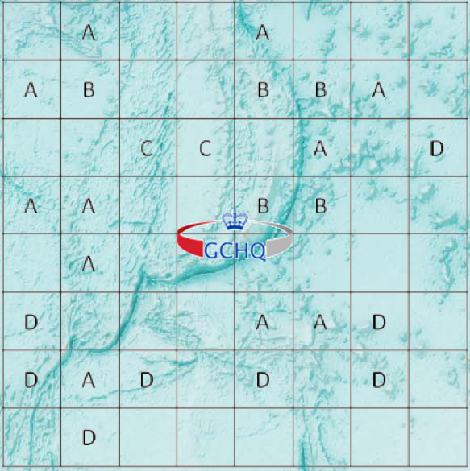

# GCHQ puzzle: MineCode

BOSS agents recovered the attached map of a major seaway, showing the planned distribution of mines. The map is encoded using the MineCode: the letters A,B,C,D represent the numbers 1,2,3,4 (but not necessarily in that order). Cells containing a letter do NOT contain a mine. A letter denotes the number of mines in cells adjacent to that cell (in any direction, including diagonally). SigInt suggests that the plan shows the location of 13 mines.Your mission is to crack the MineCode and find their planned locations to secure the seaway.

