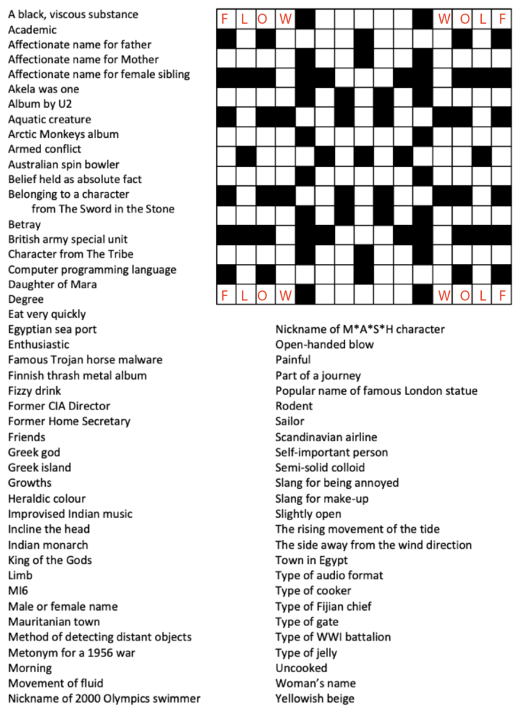

# Strange symmetry

For the late May Bank Holiday we bring you an extraordinarily Cryptic Crossword from the devious minds at GCHQ.

The grid is symmetrical, and so are the solutions! You have no numbers to guide you in placing them, but the symmetry and the clues should together be enough.

In an act of generosity we have filled in four of the answers for you to give you the idea!

Hope you enjoy it!

(If you want us to check your answers, you can just post the words you use in the same order as the clues appear here.)

