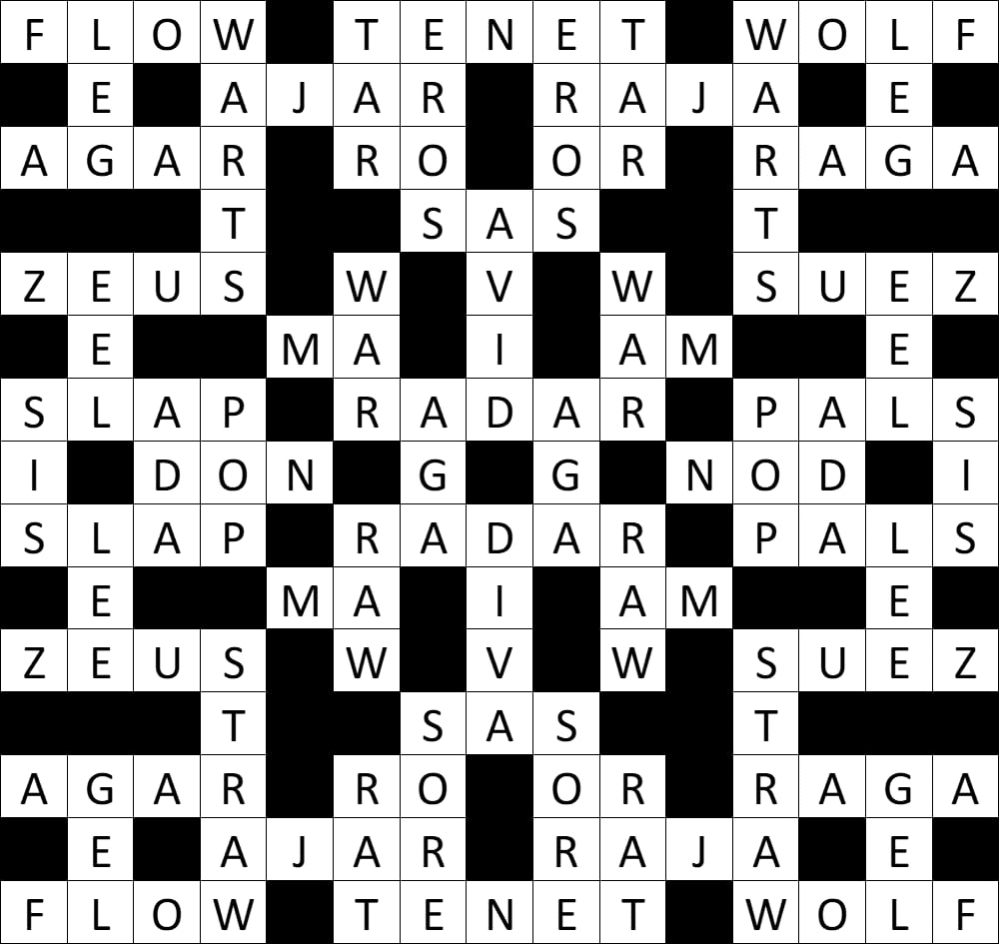

For the late May Bank Holiday we brought you an extraordinarily Cryptic Crossword from the devious minds at GCHQ. The beautifully formatted solution was provided for us by competitor Gordonwelshman. Thank you!

Hope you enjoyed it!

1 A black viscous substance TAR
2 Academic DON
3 Affectionate name for Father POP
4 Affectionate name for Mother MA
5 Affectionate name for female sibling SIS
6 Akela was one WOLF
7 Album by U2 WAR
8 Aquatic creature EEL
9 Artic Monkeys album AM
10 Armed Conflict WAR
11 Australian spin bowler AGAR
12 Belief held as absolute fact TENET
13 Belonging to a character from The Sword in the Stone WARTS
14 Betray RAT
15 British army special unit SAS
16 Charature fromThe Tribe GEL
17 Computer programming language ADA
18 Daughter of Mara RAGA
19 Degree MA
20 Eat very quickly WOLF
21 Egyption sea port SUEZ
22 Enthusiastic AVID
23 Famous Trojan horse malware ZEUS
24 Finnish thrash metal album RAJA
25 Fizzy drink POP
26 Former CIA Director TENET
27 Former Home Secretary STRAW
28 Friends PALS
29 Greek god EROS
30 Greek island RO
31 Growths WARTS
32 Heraldic colour OR
33 Improvised Indian music RAGA
34 Incline the head NOD
35 Indian monarch RAJA
36 King of the gods ZEUS
37 Limb LEG
38 MI6 SIS
39 Male or female name LEE
40 Mauritian town AJAR
41 Methode of detecting distant objects RADAR
42 Metonym for 1956 war SUEZ
43 Morning AM
44 Movement of fluid FLOW
45 Nickname of 2000 Olympics swimmer EEL
46 Nickname of M*A*S*H character RADAR
47 Open-handed blow SLAP
48 Painful SORE
49 Part of a journey LEG
50 Popular name of famous London statue EROS
51 Rodent RAT
52 Sailor TAR
53 Scandinavian airline SAS
54 Self-important person DIVA
55 Semi-solid colloid GEL
56 Slang for being annoyed SORE
57 Slang for make-up SLAP
58 Slightly open AJAR
59 The rising movement of the tide FLOW
60 The side away from the wind direction LEE
61 Town in Egypt AGA
62 Type of audio format RAW
63 Type of cooker AGA
64 Type of Fijian chief RO
65 Type of gate OR
66 Type of WWI battalion PALS
67 Type of jelly AGAR
68 Uncooked RAW
69 Woman’s name ADA
70 Yellowish beige STRAW
