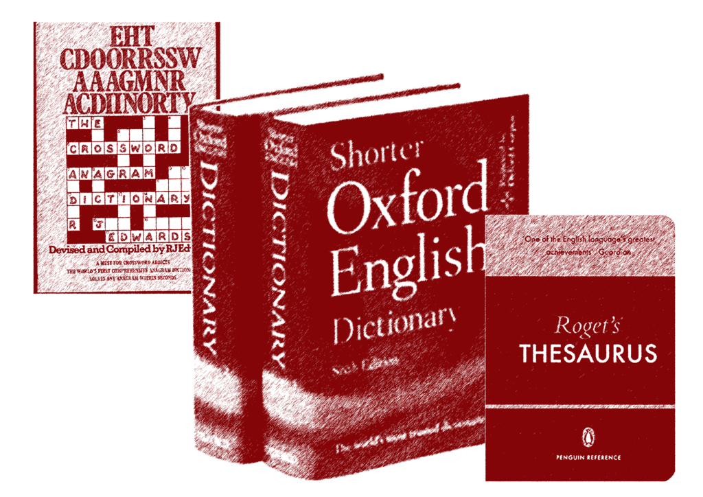

# Chain of verbal reasoning

The questions say it all this week. Can you complete the chain of verbal reasoning? As usual, post solutions to the Forum, giving the full chain in each case to show your reasoning!

1. Which country is an anagram of a synonym of a homophone of a prime number and a homophone of an anagram of a capital city?
2. Which ex Prime Minister's surname is an anagram of a synonym of an anagram of a rodent?
3. Which emotion is an anagram of a homophone of an antonym of a homophone of an anagram of a canine animal that is a synonym of an anagram of a homophone of a single digit number?
