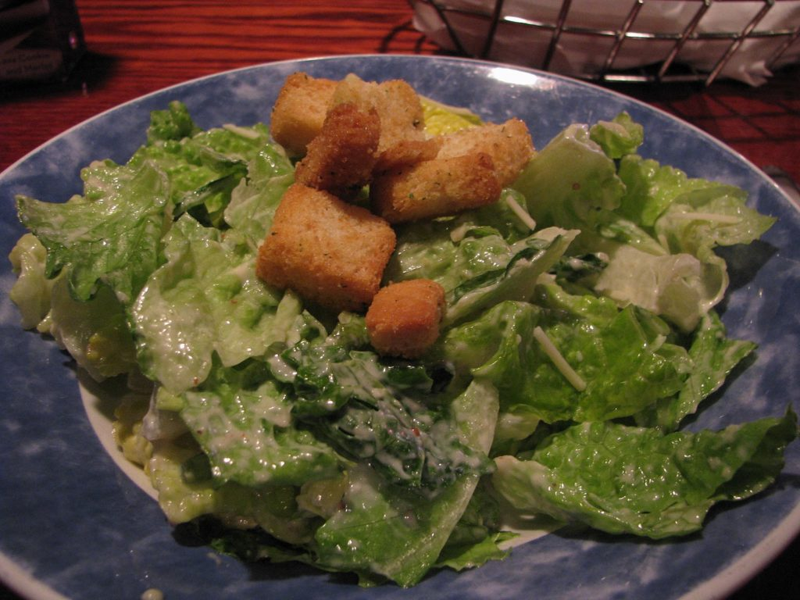
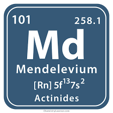

# Look there is a Caesar salad on the (periodic) table!

The answer is 101 and as of Friday morning no-one had got it, so maybe it should have been a 4 on the rotor scale. This rather cryptic puzzle take symbols from the periodic table and shifts them using a Caesar shift cipher to get others. So, for example, the first one is the symbol for Helium (second element) He, shifted by 4 to give Li, which is Lithium.

I am not sure I would have got this without a very big hint, so well done if any of you did.

2 + 4 = 3

Second on the table is Helium. He shifted by 4 is Li, so the answer refers to Lithium which is third in the table

7 + 1 = 8

The seventh element in the table is Nitrogen with symbol N. Shifting that by 1 gives O which represents Oxygen. Oxygen is eighth in the table

12 + 1 = 113

The twelfth element in the periodic table is Magnesium with symbol Mg. Shifting by 1 gives Nh which is the symbol for Nihonium which appears in position 113.

13 + 2 = 112

The thirteenth element is Aluminium (Aluminum?) with symbol Al. Shift it by 2 to get Cn, the symbol for Copernicum at position 112.

20 + 1 = 105

Twentieth in the table is Calcium with symbol Ca, Shifting by 1 gives Db which is the symbol for Dubnium (surely the coolest and hippest of the elements) at position 105.

Then what does 10 - 1 equal?

The tenth element in the table is Neon with symbol Ne. Shifting back by 1 gives Md, the symbol for Mendelevium at position 101!
