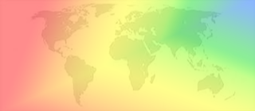

# Rainbow nations

If RED+RED+BLUE=YELLOW in Australia and GREEN+GREEN+PURPLE=RED in Canada, what does PURPLE+PURPLE+ORANGE equal in the UK?

This one doesn’t give you much to go on and requires a little bit more lateral thinking. And tea. Maybe a lot of tea.

Once you have solved it, post your time on the Forum.
