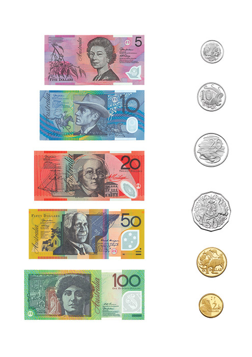
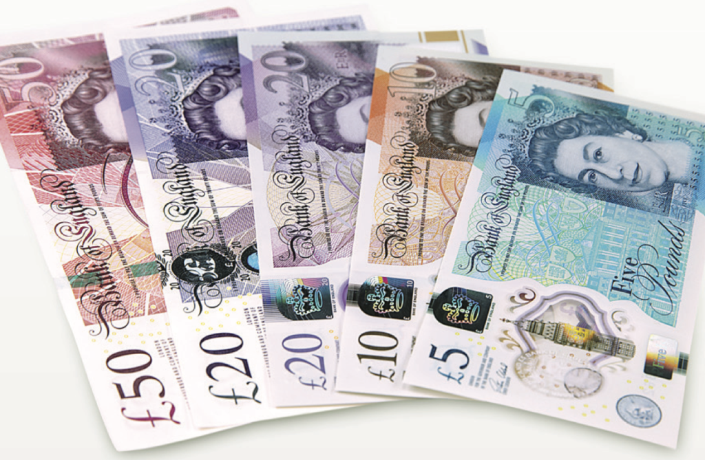

# Rainbow nations

If RED+RED+BLUE=YELLOW in Australia and GREEN+GREEN+PURPLE=RED in Canada, what does PURPLE+PURPLE+ORANGE equal in the UK?

ANSWER: RED. The colours represent the denominations of bank notes:

 

