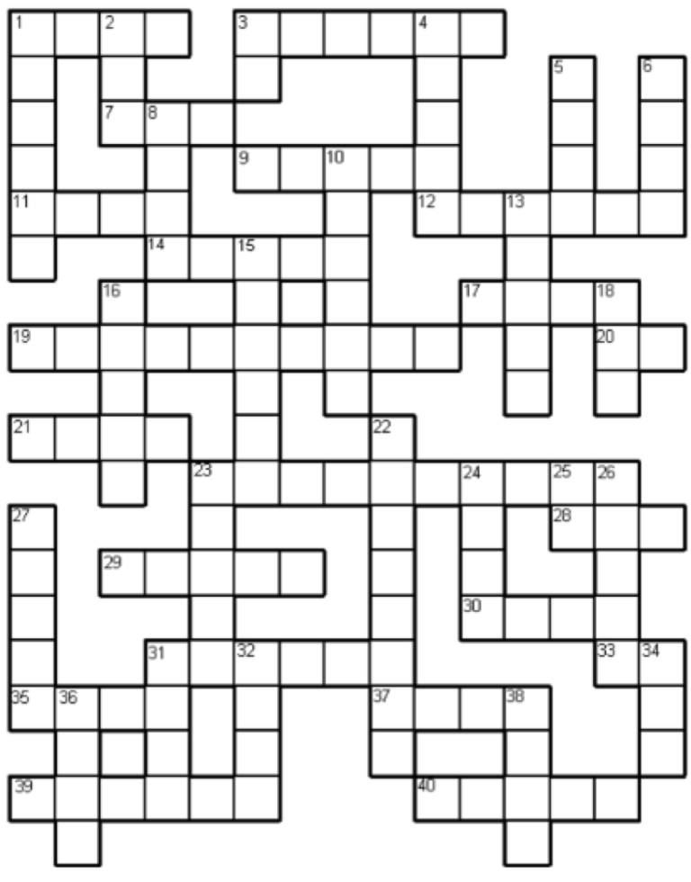
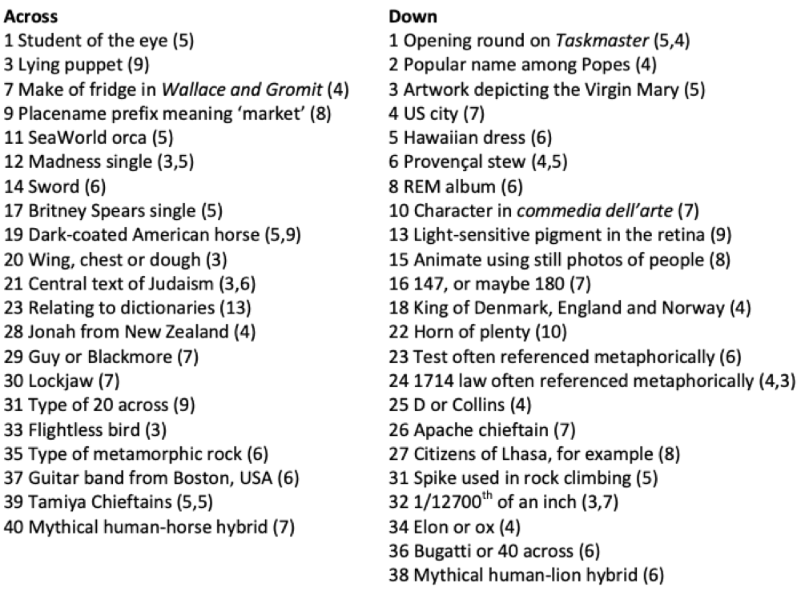

# VE Bank Holiday Crossword

Something completely different for the Bank Holiday Weekend! At first sight you might think we have made an error with the letter counts, but the GCHQ geniuses mean exactly what they say!

This is a crossword with a twist -- each cell contains exactly one letter, but 38 characters are used in all!

We will be back on Sunday with another challenge! (and a hint for this one, but not the solution -- you will have all weekend to try it!)

