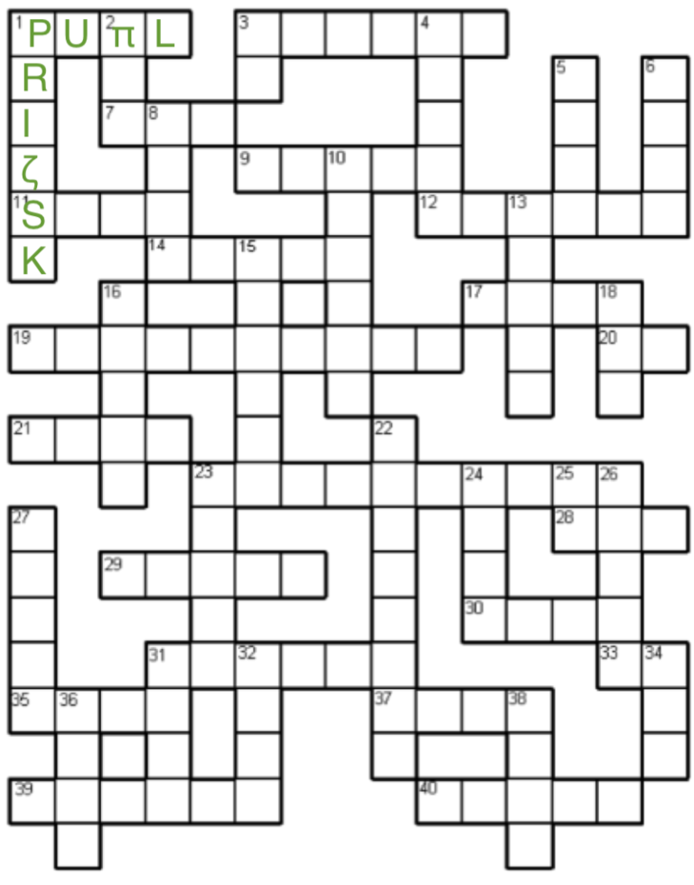

# GCHQ Puzzle Challenge 6 -- Harry’s Last Hint

# VE Bank Holiday Crossword (Now with a couple of the answers supplied to get you started)

Something completely different for the Bank Holiday Weekend! At first sight you might think we have made an error with the letter counts, but the GCHQ geniuses mean exactly what they say!

This is a crossword with a twist – each cell contains exactly one letter, but 38 characters are used in all! They all come from the English and Greek alphabets, and we have filled in a couple of the answers to help you get started:

1 Across: Pupil (P U Pi L)

1 Down: Prize task (geddit? Zeta in the middle!)

We will be back on Sunday with another challenge! (and a hint for this one, but not the solution – you will have all weekend to try it!)

