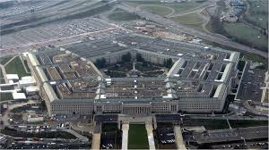

You would think the Pentagon would be the most obvious answer, though in fact more people chose the Baltimore World Trade Centre as their pick of the world’s five sided buildings. The arithmetic is on the number of sides of each of the named ones. Well done if you got it!
