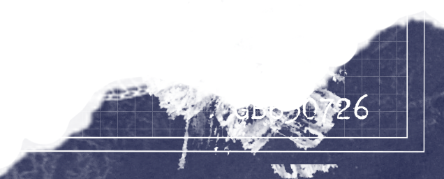
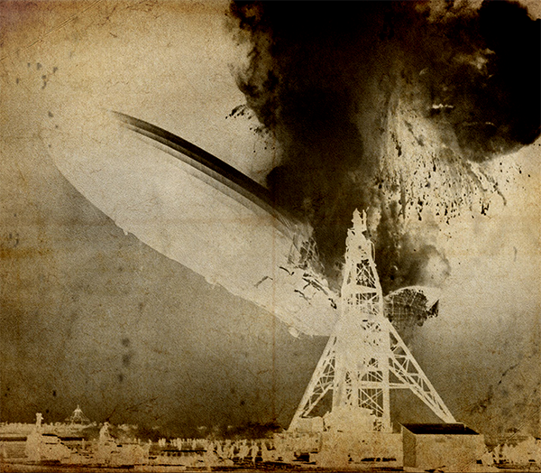
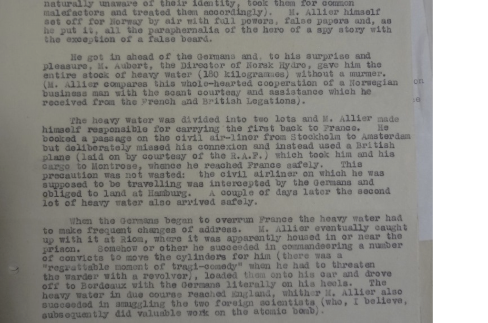
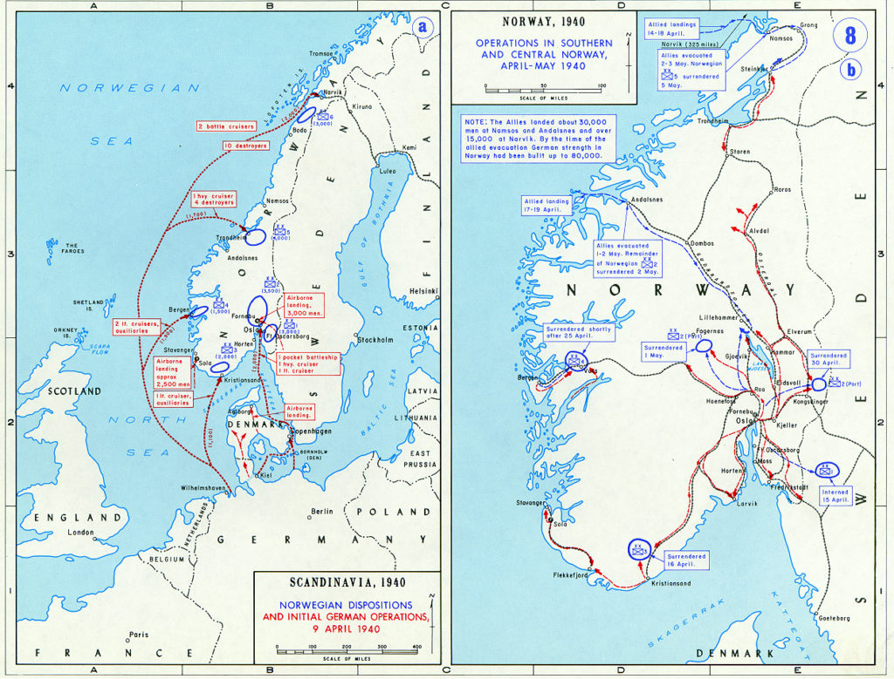
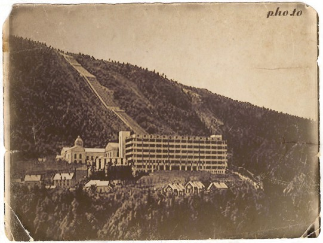
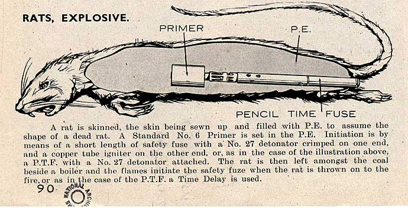
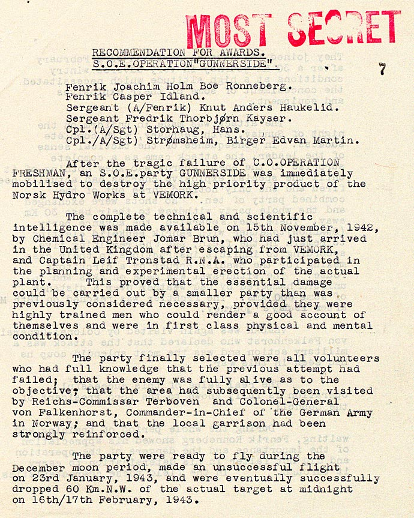
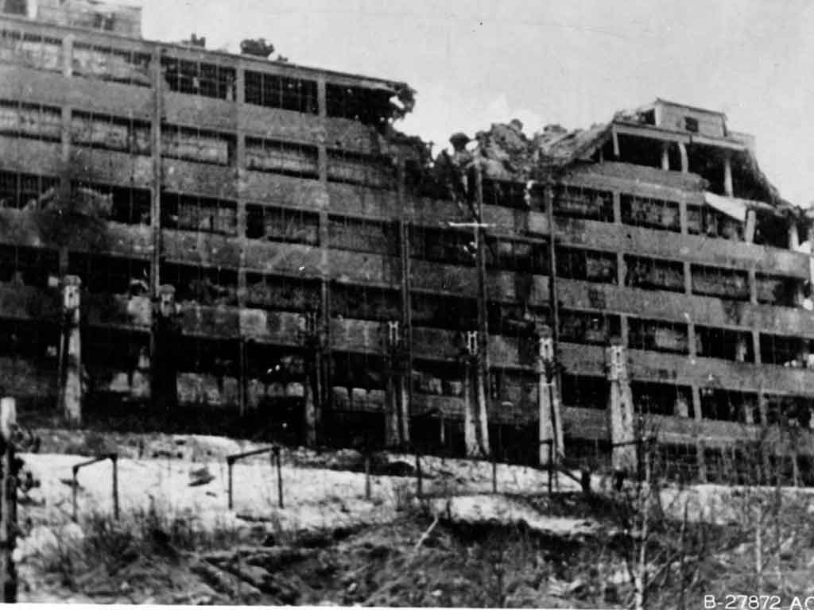
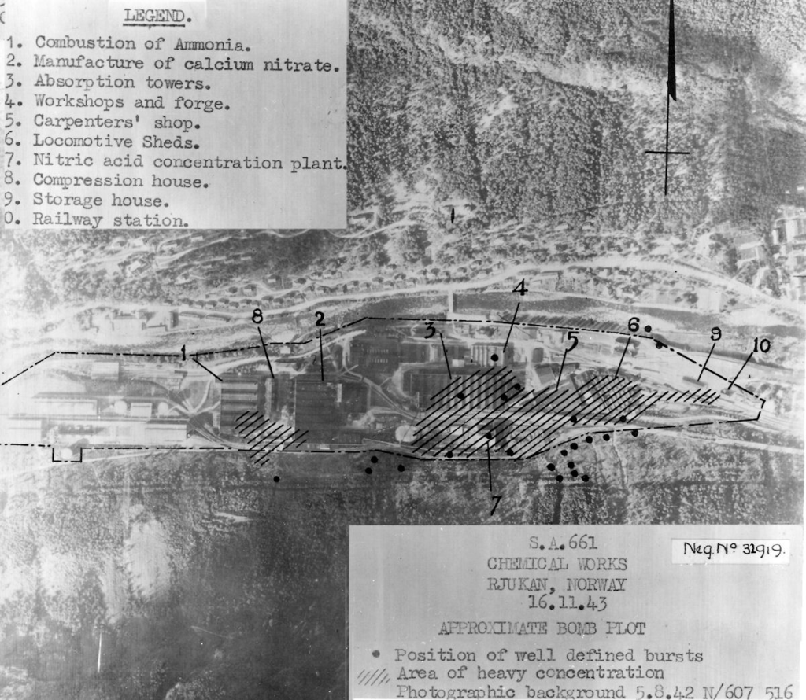
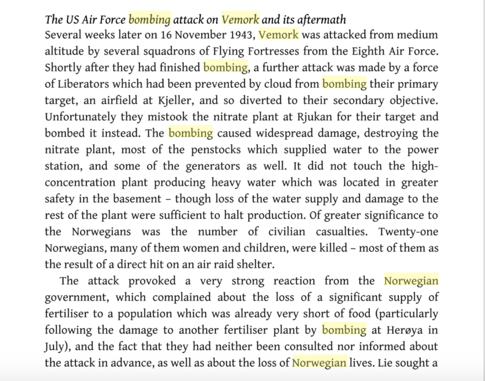

# TOP SECRET
# BOSS CURRENT CASE FILES

Boss training staff will occasionally post supplementary material here to help you solve the case. You should use it alongside any data or clues you find in the official texts published on the Challenge pages.

A burnt envelope found in the wreck of the Hindenburg  

A scrap of blue paper found in someone’s luggage in the wreck  

Notes from the debrief about Allier's travels. with the heavy water  

The Nazi invasion: Unternehmen Weseruebung

The Vemork power plant in 1935  

An official explosive device from the SOE handbook, Descriptive Catalogue of Special Devices and Supplies  

The citation for Operation Gunnerside  

The aftermath of the Vemork bombing raid  

Post mission analysis  

The fallout from the raid  

