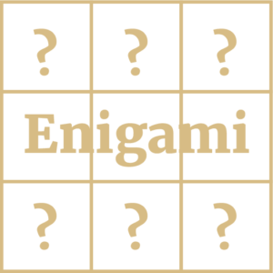

Our second puzzle is another from Roderick Kimball's Enigami stable IS RODERICK KIMBALL, the fiend behind [Enigami](https://www.enigami.fun/about). Roderick was born in BC, making him either ridiculously old, or simply Canadian. In his youth, Roderick was sometimes spotted on the slow end of a soccer pitch but more often on the fast end of a chess board. (Surely you've heard of the notorious Kimball maneuver, in which one opens a chess match by flipping the king's pawn into the air such that it lands, butter side up, on the king's fourth rank.) Roderick has created puzzles for the National Museum of Mathematics, Games Magazine, Reader's Digest Canada, NPR's Ask Me Another and for his own amusement.  In the other half of his life, Roderick has toured the world juggling with the Flying Karamazov Brothers.  He also recently returned from Kenya, where he was sent by Engineers Without Borders to help folks with improving their water supply.  He is proud to say that his ancestry includes two very great grandmothers who were executed as witches and he once made bottled water come out Rosie O'Donnell's nose.

Arrange the numbers 1 through 9 in the grid so that all of the conditions in the puzzle are satisfied.  Every number is used once. The rules are

- The number in the lower left corner is the sum of the numbers in all the other corners.
- There is a column with a sum of 10.
- No even number is immediately to the left of another even number.
- One row has a product of 30.
- There is a row with a sum of 21.
- No odd number is immediately below another odd number.

