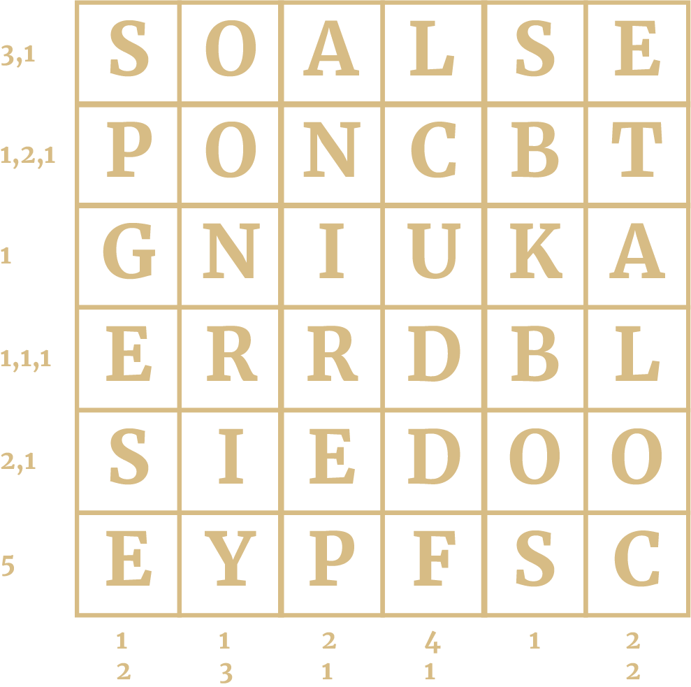

# BOSS PUZZLE CHALLENGE 4

Our fourth puzzle is from Mr. Enigma himself, Tom Briggs. It is rather different from the first three, in that we won’t be telling you what you need to do (at least at first). You will have to (try to) work it out for yourself. If you do manage it you should be able to find a hidden message so you will know. We will post a hint midweek if you are still stuck then.

Tom Briggs is a National Cipher Challenge veteran, having been introduced to it around a decade ago as a teacher when his Head of Department dropped a poster for it on his desk and said "you're a nerd: do this." He *is* a nerd and he *did* do it, and never looked back: On a weekly basis he and his motley crew of codebreakers recruited on the sly from his maths classes got together to see what Harry and friends were up to. He learnt as much from his students as they did from him, and he eventually ended up at Bletchley Park itself, albeit a few decades too late to help out with the war effort. Now (with the help a shadowy figure known only as *Coronavirus Pandemic*) he has "gone rogue" and branched out on his own: he's undercover as a maths teacher again, but working on some top secret projects that you can only find out about if you're in-the-know (or just visit [tkbriggs.co.uk](http://tkbriggs.co.uk))

You probably don't know what to do! Good luck.

