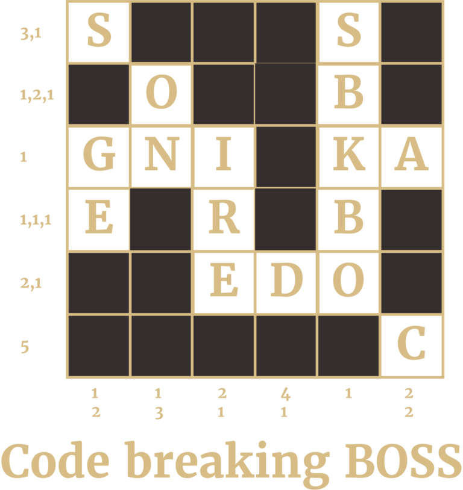

Did you figure out what to do? The numbers to the left and under the puzzle tell you to delete letters in blocks like a crossword, leaving a message that you could read, but backwards from the bottom right to make it tougher to see.

