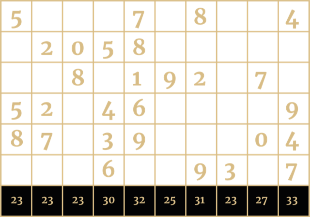

OUR RESIDENT GUEST PUZZLEMASTER IS TLW, THE LETTER WRIGGLER, whose identity, like those of all our officers and agents, is a closely guarded secret.

TLW first became interested in ciphers after reading Simon Singh's The Code Book in 1998. He found the now NCC web page way back in the early 2000’s and has enjoyed every years session since, but until 2019 he remained a 'lurker' never registering (because it was for schools only and did not think he should).

His current interests and hobbies include electronics, recreational maths & puzzles, number theory and ciphers, and learning to play his Yamaha Tyros keyboard.

In the completed puzzle the numbers 0 through 9 appear in each of the top six rows of the grid so that they give the column sums at the bottom and no number appears in twice in adjacent cells, including diagonal adjacency.

