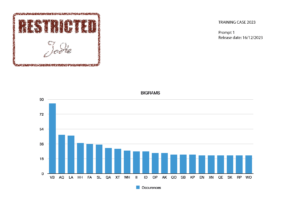

16th December 2023 at 9:00 am 
#92746 
Harry 
Keymaster

**The first official hint for Challenge 10B**

We assume you have already carried out all the standard tests and decided this is not a mono alphabetic uni-literal substitution cipher, so if you haven't already tried it, your best bet is probably to start looking at bigrams, trigrams etc. To get you started here are the most common bigrams in the cipher text:

