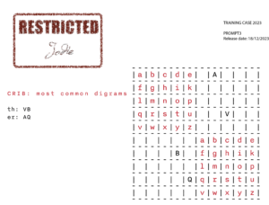

18th December 2023 at 9:00 am
#92765
Harry
Keymaster

The third official hint for Challenge 10B

Since the fragments showed plaintext squares top left and bottom right of the page, we might guess this is a Four Square encryption. We can use that along with our bigram count to start filling in the square. At this stage these are only guesses and further analysis will be needed!

