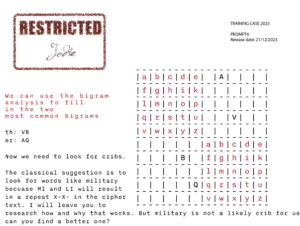

21st December 2023 at 9:00 am 
#92768 
Harry 
Keymaster

The fourth official hint for Challenge 10B

Now we think we know a couple of entries in the encryption scheme we need to look for some more. The traditional way to do this is using cribs. Here is a suggestion of how to start:

