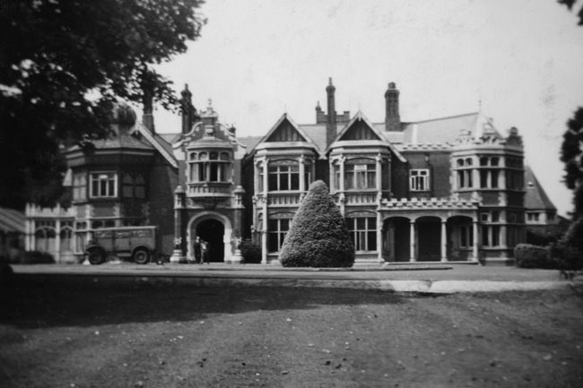

# A guest post from an alumnus of the competition

7th March by Harry

Every year following the National Cipher Challenge prizegiving I find myself feeling sentimental.

Five years ago when I first participated in the competition, I never imagined I’d one day be sitting at Bletchley Park as an invited alumnus. Back then, I was just trying to understand how the ciphers worked and hoping I might eventually solve one without too many hints, and I certainly never thought I’d ever be good enough to be invited to the prizegiving itself.

And yet this year I was there again, not as a competitor hoping for a prize, but as an alumnus with my team celebrating the achievements of other eligible competitors with their families and teachers. 

I think there’s something rather special about that moment. You not only realise how far you’ve come, but also how many people helped you along the way: teachers, friends, parents, people on the forums. 

At this year’s event, guest speaker Rob Eastaway gave a brilliant talk about (counter-)intuition and how often our instincts can lead us down the incorrect solution. But one moment that stuck with me was when he mentioned how AI almost never responds with “I don’t know”. Try it yourself, ask your favourite LLM, “Why don’t you ever say ‘I don’t know’?” and see what happens.

We hear a lot about AI at the moment, and how ‘intelligent’ it’s becoming, but there are still things that it can’t replace. In many ways, I believe that problem solving begins with the willingness to admit you don’t yet know the answer, and the curiosity to keep exploring until you do.

AI can certainly generate answers, but it can’t replace the experience of solving something meaningful together with other people. It can’t replace the moment when someone on the forum posts a small hint that suddenly unlocks a problem you’ve been stuck on for hours. It can’t replace the pride you feel when another student finally cracks a cipher they have been wrestling with for days, and it definitely can’t replace the friendships and collaborations that form along the way.

No conversation with an AI can replace the feeling of another human choosing to spend their time helping you through something difficult. And equally, no algorithm can replace the sheer joy of finally cracking a ciphertext after hours of effort.

What I’ve realised over the years is something quite simple: one of the things humans can do that AI cannot is share in the joy of someone else finally solving something difficult.

Looking back, the Cipher Challenge is one of the places where I’ve seen that most clearly. Even after school ends and everyone scatters to different universities, the challenge still provides a reason to come back together. You might not be competing for prizes anymore, but that doesn’t mean there isn’t still a reason to participate.

Some of my favourite moments now come from posting on the forum and seeing someone else discover the joy of problem solving. Sometimes it’s just a small hint, or someone asking a question that nudges another person in the right direction, other times it’s reading about someone finally crack a cipher they’ve been stuck on for days.

I also love speaking to teachers from other schools and meeting younger students from my former school at the prizegiving and hearing how they got on with the challenges. It’s a wonderful feeling when someone tells you that something you said or posted helped them. Five years ago I was the one looking up to other people on the forums and wondering how they were able to see things I couldn’t yet. And even now, a few years later, I still approach the challenges with the same excitement I had in my first year. 3pm on Thursday during the NCC season continued to be a sacred time for ciphers, even if I was in a lecture, because I was always curious to see what the next challenge looked like or to contribute to an ongoing discussion on the forum.

So even if you’re no longer eligible for prizes, it’s still worth taking part. The leaderboards are fun, but the real value of participating, at least from my experience, is being part of something larger. You never quite know how much of an impact you might have on someone else, sometimes simply by sharing how you approached a problem.

And in many ways, the lessons stay with you as well. Some of the most difficult things I’ve faced over the past few months were made more manageable because of what I learned while struggling with the challenges. Patience, persistence, and the willingness to keep trying different ideas even when the solution isn’t obvious are skills that apply far beyond cryptography.

With the 25th year and the Silver anniversary approaching, there is one extra incentive, namely the alumni leaderboard. 

But more than that, it’s a chance to be invited back again. To walk around Bletchley Park once more, see familiar (and new) faces, catch up with people you might not have seen in months, and somehow fall straight back into conversation as if no time has passed at all.

School days may have ended and everyone may now be at different universities and busy with their lives. But for a few months each year, the challenge brings us back together again to wrestle with ciphers and test our ideas against the best and brightest minds behind the challenge (and perhaps investigate the increasingly compelling conjecture that teams named after birds have a statistical advantage)
