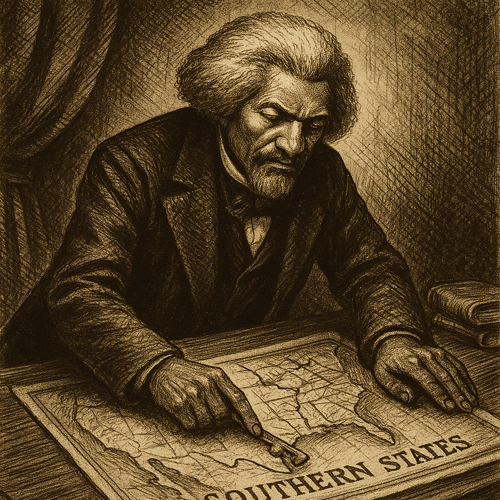

#Case File 0.1

It is 1867. America is still reeling from the after-effects of a bitter civil war. The South is struggling to adapt and reconcile to the new reality of federal co-existence while the North is striving to establish a new economy, reintegrating the secessionists and establishing the civil rights of the newly freed slaves.

In this fervid atmosphere political tensions ran high. It was a VERY strange time to embark on a book signing tour, possibly the worst time. But also possibly the best time. It all depended on what his tour was for. And that has remained secret for over 150 years. Your task is to unravel the secret, or secrets , behind his mission!
