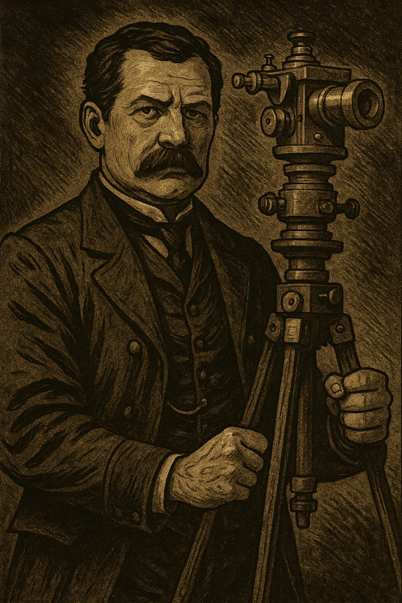

# Case file 1.1

Grenville M. Dodge was an ex soldier and engineer who made his fortune in the reconstruction after the civil war. From his letter to Dickens it seems that he had a social conscience, but perhaps that is not surprising for someone who dedicated himself to the unionist cause and all it stood for. He seems to have been a friend or acquaintence of Charles Babbage, which perhaps suggests that there might be something more to his letter, but only time will tell!
