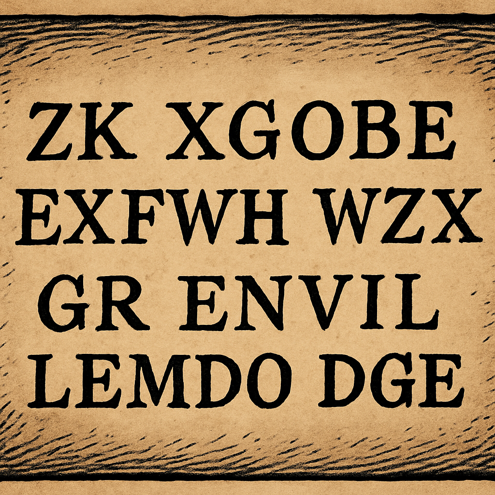

# Case file 1.2

Sometimes a guess as to who sent a message is all you need to get started breaking the cipher! Notice how the X and Z in this fragment at the end of the cipher text line up with the G and the E in the General’s name! What does that suggest?
