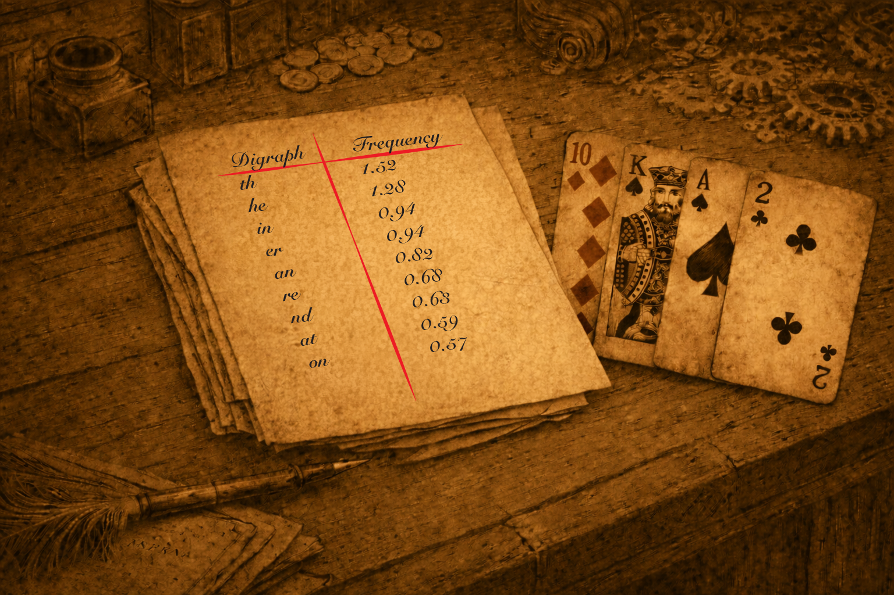

# Case file 10.7

    In a digraph cipher like this, frequency analysis is not quite as helpful as it is in a simple substitution, but it can still help. The most commendable digraph in English is “th” and helpfully that is also the most common digraph in the plaintext for this message. Given that this is some form of the foursquare cipher that should allow you to enter at least one of the plaintext pairs! After that the frequencies are not quite as helpful and you have to figure out what else you have that might help you fill in more of the grid!

