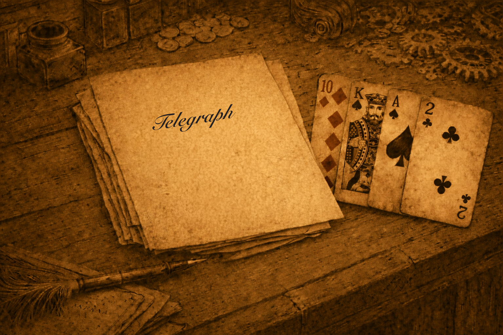

# Case file 10.8

> Did you think of using the word “telegraph” as a crib? You should be able to assemble the pairs “ra” and “ph” in the grid from the cribs “th”, Babbage” and “REPORT” so if you can find the corresponding pattern in the text that should give you the pairs “el” and “eg” as well.
