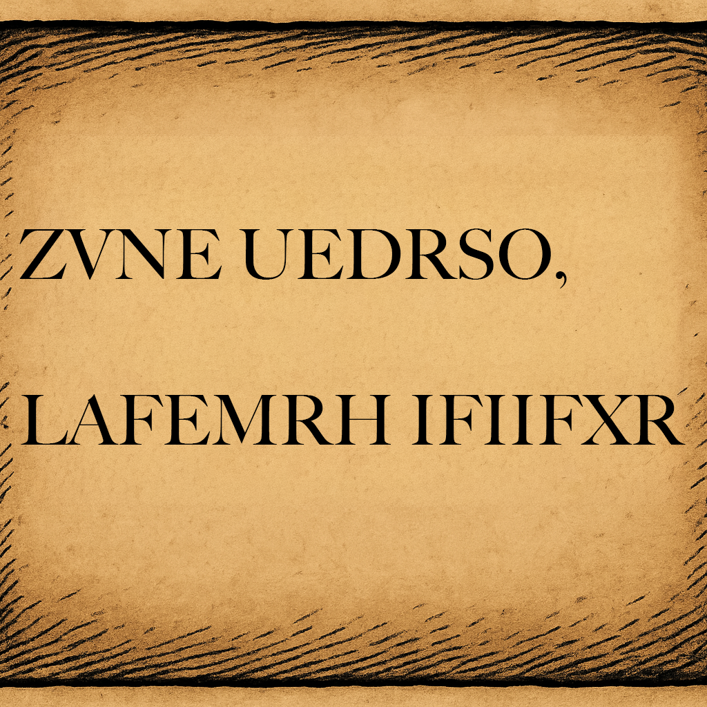

# Case file 2.1

It is always worth checking the text at the start and end of a message to see if there are any suggestive patterns. In this case our correspondent has laid out the letter in traditional style, so perhaps this is his signature? Does that help at all? You could also look for three letter words and take a guess that they are AND or THE to see if that gives you more of the text, though knowing this is an affine shift cipher allows you to also be a little more systematic if you want!
