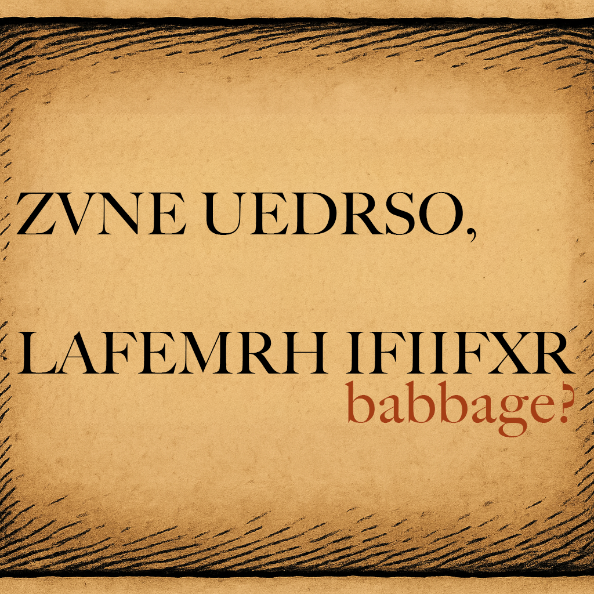

Case file 2.2

Since we already know that Babbage wrote the letter, the pattern IFIIF (reflecting the pattern babba in the name) is really suggestive. Whatever cipher has been used to create the message probably encrypts A as F and B as I. But that is not all we have. Your BOSS training staff have also told you that the cipher is an affine shift cipher, so this is the affine shift that moves A to F and B to I. As F and I are 3 apart in the alphabet and a and b are 1 apart, this tells you that the multiplication factor in the cipher must be 3! That really cuts down the possibilities.
