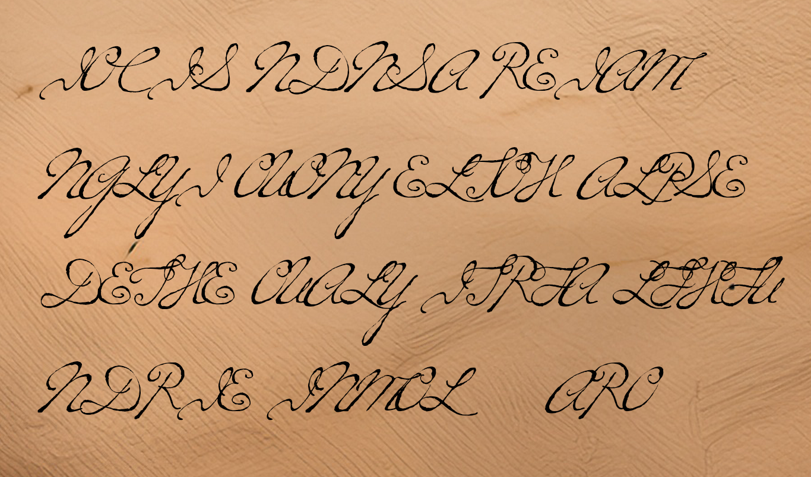

Case file 3.1

The transposition cipher used in part B splits text into blocks which are each permuted, usually all the same length and in the same way. But this text has 728 characters and that only factorises as 2×364. Blocks of length 2 are very unlikely and blocks of length 364 would be totally impractical. It looks like something is wrong, or perhaps missing. 729 = 3^6, so perhaps the blocks have length 3 or 6, but it is more likely that there are two characters missing and the text had 730 characters. 730 = 2x5x73 and blocks of 5 work very well for the rest of the message. That leaves us to decide what could go at the end. If you look at this image of the original letter you can see what might have happened. It looks like the letter writer was comfortable using spaces as padding characters and the clerk who typed the transcript for the archive didn't think they were important. In this case they really were!

Good luck, Jodie.
