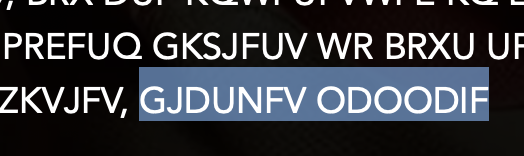

# Case file 4.2

When I am trying to break an encrypted letter I always find the salutation and the signature very helpful. They are an excellent source of cribs. If we assume this is a letter, what names might fit? that surname is very distinctive. Do we know anyone in this story whose name has a letter appearing three times in it? A good guess here can unlock the rest of the cipher, and and you can use the substitution cipher tool on the cipher tools page (duh!) to help you break it.
