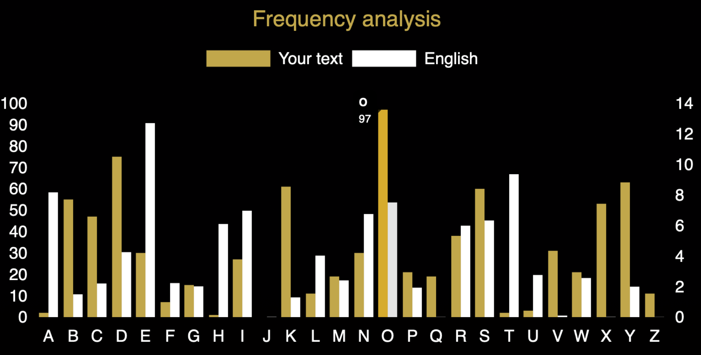

Case file 4.3

Did you look at the frequency count we showed you yesterday? The highest peak at O in the cipher text probably means that it represents the most common letter in English, which is E, so the substitution probably converts E to O, which is a jump of ten (FGHIJKLMNO). The second highest peak at D might well represent T as that is often the second most common letter and gap from T to D is also ten! (UVWXYZABCD) This is very suggestive of a Caesar shift cipher, so it is worth heading over to the Caesar Cipher Tool to see if that breaks the cipher: https://www.cipherchallenge.org/tools/
