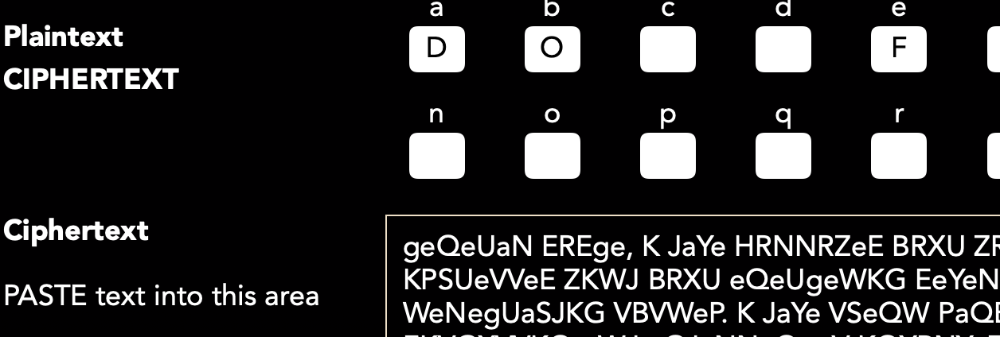

Case file 4.4

Did you guess right? Guessing is always worthwhile as a good guess can yield good evidence for a cipher. We have a number of characters in this story and if you make a list of their surnames you might spot that the one that has the same pattern ODOODIF is the name BABBAGE. If you guessed that, well done. If you enter that into the Substitution Tool on https://www.cipherchallenge.org/tools/ and paste the cipher text in the box below it the tool will start to decipher the text for you. If you look at the start of the message you might be able to guess some more letters! Entering them in the boxes above will break more of the cipher. For example the single letter K on its own must surely be an I or an A, and we already think that D stands for A so we can safely guess K stands for I. Try it and see what you can work out for yourselves!
