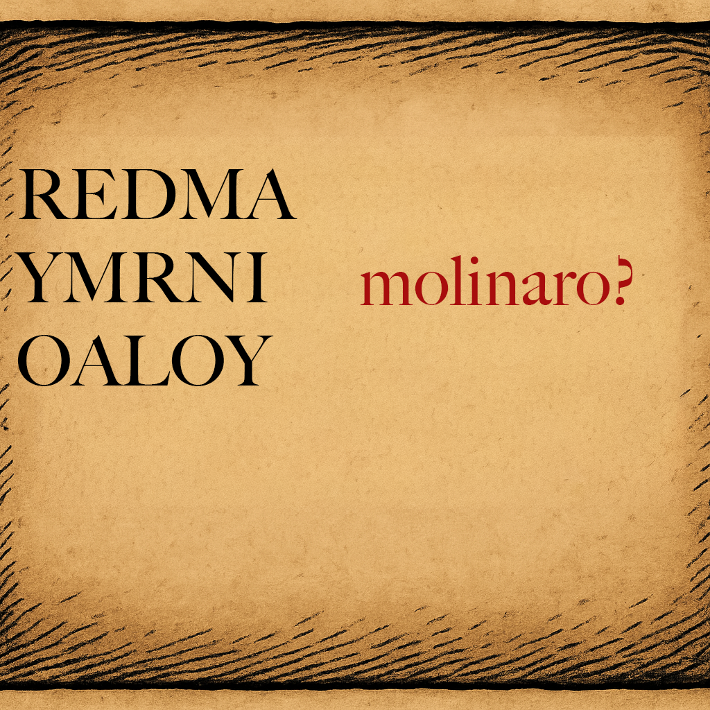

# Case file 5.1

It is always worth looking for a crib when you are unsure about what else to do. If you already worked out that the letter frequency distribution in 5 part A looks a lot like the standard distribution in plaintext then that should have given a strong hint that this might be a transposition cipher, and the best best way to break them is to look for a word that you might recognise, which you can use to try and figure out the permutation used. Looking at the start of this text we see letters that could be rearranged to give the name Molinaro, and while we can’t be certain which permutation has been been used just from that, there are not many that would work. What makes this a little tricky is that there are two possible O’s and two possible M’s that might have been used for the name, but a bit of trial and error should put you on the right track, especially if you can figure out how this message might have started!
