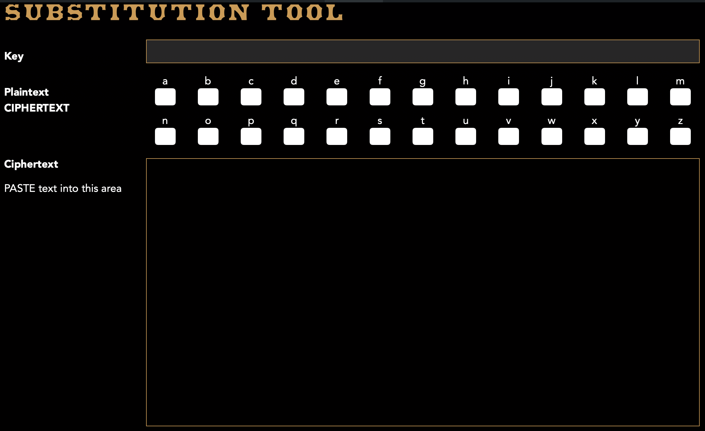

#Case file 5.2

Part B is in some ways a bit more straightforward than part A this week. The frequency counter shows that the plain text has most likely been encrypted using a substitution cipher and that the most common letters in the cipher text are O and then F. Searching for triples of the form F_O and O_F we see that FQO is common and therefore likely to stand for “the” which is an excellent start. While ti is not conclusive, it is also very suggestive that A appears almost exactly as often as “a” should appear, so it is also possible that A stands for a in the plaintext. Finally, S, B and M are the least commonly occurring letters in the cipher text, and given the frequencies shown on the standard frequency tables for English text, they probably stand for J, Q and Z in some order. That should be enough to get you started
