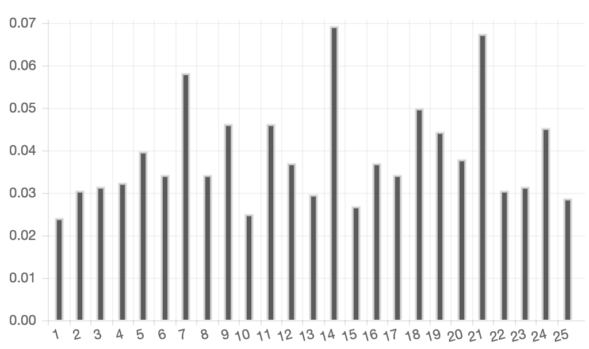

Case file 6.2

If you followed the video in Case File 6.1 you might have already computed the index of coincidence for the various possible key lengths for the Vigenere cipher in 6B, but if that is taking a little too long. Here they are already computed. As you can see there are peaks at length 7, 14 and 21 strongly suggesting one of those possibilities for the key length in the cipher. Given that it was almost certainly encrypted by hand, key length 7 is the most likely choice, so every 7th letter will have been encrypted with the same Caesar shift and you can use frequency analysis on those sets of letters to work out the keyword. Good luck.
