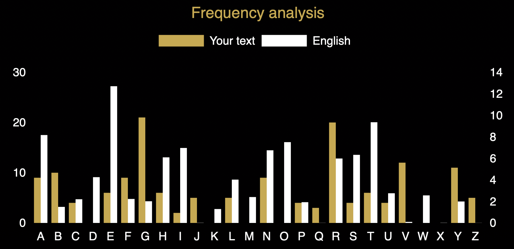

Case file 6.3

In Case File 6.2 we worked out that the Vigenere keyword we are looking for has length 7, so we can treat the cipher as a collection of 7 different Caesar shift ciphers. The first one is used to encrypt the 1st, 8th, 15th, 22nd characters and so on, while the second encrypts the 2nd, 9th, 16th, 23rd … You get the idea. We can break these one at a time by using frequency analysis. Here we are trying to find the first Caesar shift so we are computing the frequencies of letters in positions 7k+1 using the app on our BOSS cipher tools page. A look at the table shows that G and R are the most common letters in those positions, so E is probably enciphered as one of those two letters for that shift. R results in the first character deciphering as M which is promising as a lot of the documents we have looked at start MY. That gives us a strong hint as to the second shift too. Could the ciphertext letter C stand for the plain text letter Y? That would imply that the shift for characters in positions 7k+2 would send E to I, and lo and behold, I is indeed one of the most common letter in those positions.
