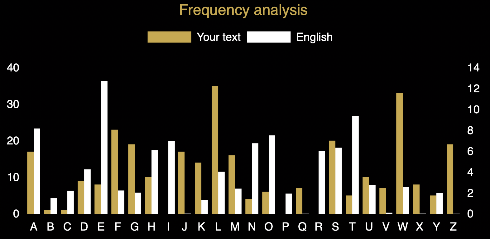

#Case file 7.1

You already know that the key length for this Vigenere cipher is 7, so you just need to break the text into pieces and analyse them separately. I have started by showing you how to deduce the first letter of the key word, by analysing the 1st, 8th, 15th letter etc. to work out which shift is used for them. You can do the same for the 2nd, 9th and so on to get possibilities for the second letter of the keyword and work through the 3rd etc, to get all 7 shifts. Even if you make a mistake with some of them, carrying out those substitutions will help you to spot cribs that will then assist you in correcting the keyword! For the first letter we see that shift is likely to either carry E and T to L and W in some order. A shift of 18 does the trick so the key probably starts with S.
