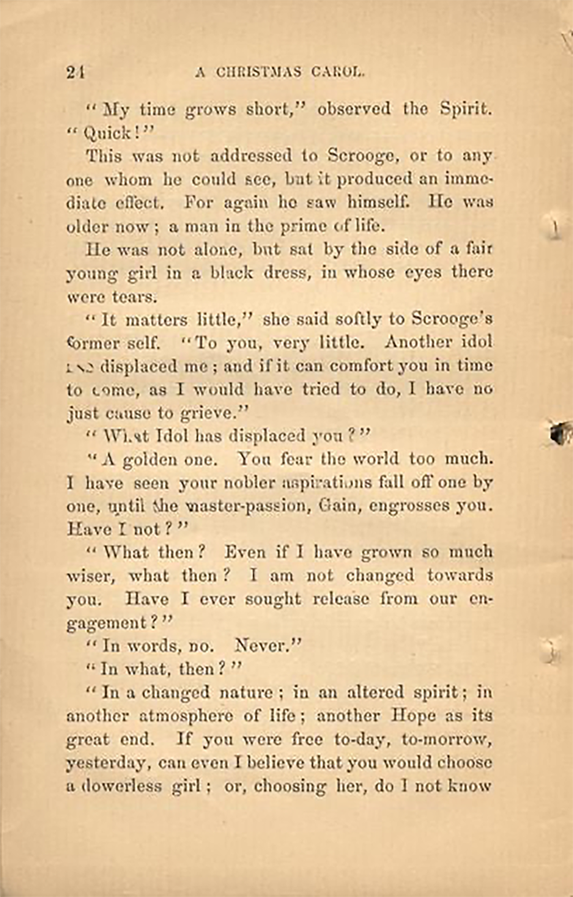

# Case file 8.2

Remember that messages between Babbage and Dodge are to be encrypted using a Playfair cipher, for which you need to complete a keyed grid. In this case the key is supposed to be taken from an agreed book, and Babbage has asked Dickens to tell Dodge the key. Luck is on our side because someone has attached the relevant page in the case file and that narrows down the possibilities a lot!
