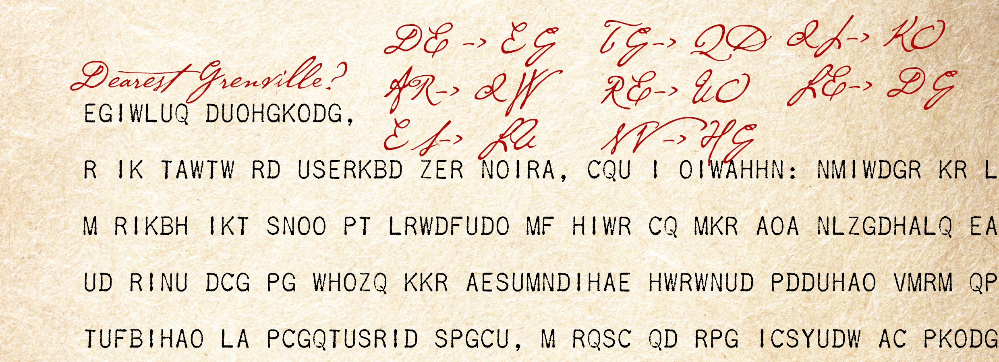

# Case file 8.3

We can use the word structure to take a guess at a crib, and here I took a leap and guessed that the message began Dearest Grenville. That gives me some info about the Playfair substitutions as noted here. You should particularly note

DE->EG and LE->DG [really sorry about the typo earlier, Jodie]

which can only happen if these letters are all on the same line of the grid! You could also take a stab at the signature to get some more insight.
