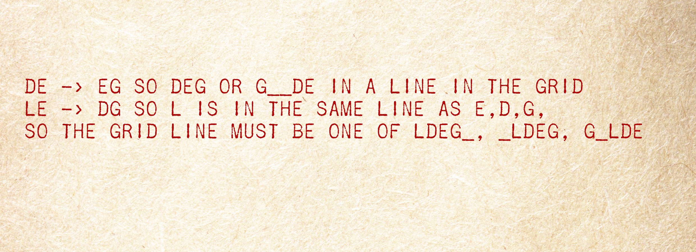

#Case file 8.4

We saw that the letters D,E,L, G must be on the same line of the Playfair grid, but thinking about how the cipher encrypts pairs on a line, by shifting them one to the right, tells us more about the line they are in. Can you use that together with the page from which the key is taken to guess the key?
