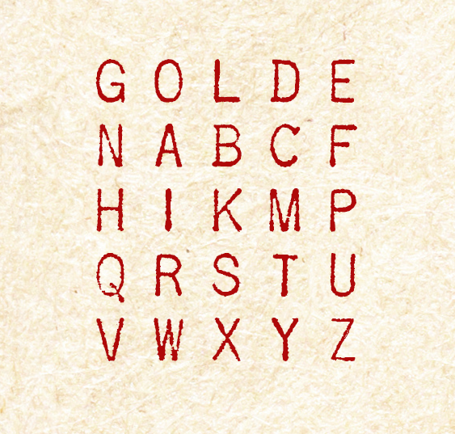

# Case file 8.6

If you are still stuck, here is the completed Playfair Grid that Babbage has used to encipher his message to Grenville Dodge. You should practice using it to decipher the message (which is just the opposite of enciphering) so you get familiar with the idea.
