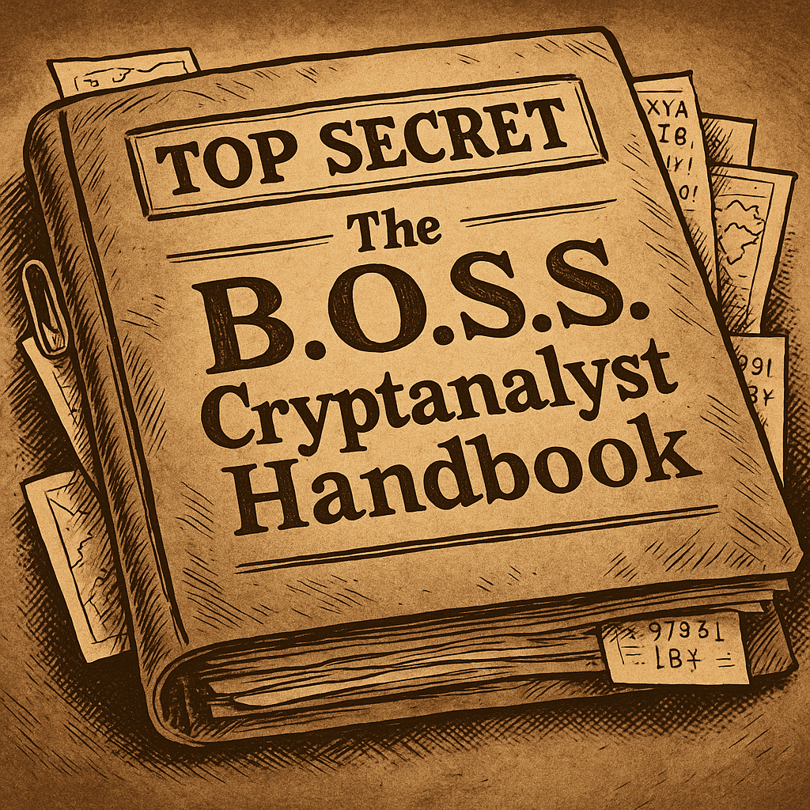

# Case file 9.2

> The document in part A this week was believed to be a letter from Babbage to Dickens, which I found useful. When the cipher clerk who was handling it for me tried to break it she was very confused. She was pretty sure that she knew what cipher it was and how long the key must be, but even with a brute force through the dictionary she wasn’t getting English words out of the decrypt. It took me a minute to see why and hopefully you will get it too, but it may take a while to break this one. I will say that it is worth trying what you have already learned. It will get you at least half way there!.
>
> Good luck, Jodie
