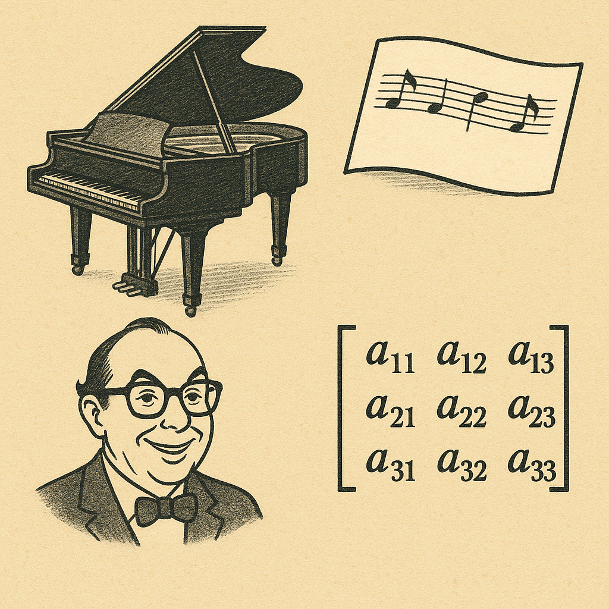

# As we while away the hours …

5th November by Harry

until we launch the main competition with Challenge 4, I thought you might be amused by the controversy raging on the interwebs about the beauty (or otherwise) of matrix multiplication. If you have already suffered through the hours of practice it can take to really master linear algebra you might have some sympathy with the journalist who wrote, in the New Yorker,

> “matrix multiplication, to which our civilization is now devoting so many of its marginal resources, has all the elegance of a man hammering a nail into a board. It is possessed of neither beauty nor symmetry: in fact, in matrix multiplication, a times b is not the same as b times a.”

On the other hand, if you have mastered this increasingly important art then you probably already recognise the fallacy in the statement. It is true that in general AB is not equal to BA when A and B are matrices, but that is their strength. It is a feature, not a bug. Lots of things in life don’t commute, i.e. the order they happen in matters. The classical example is that putting on your shoes after your socks gives a very different result to doing it the other way round, and the order of the words and letters in a sentence matters! Is this a fact? This is a fact!

Because matrices don’t (always) commute they have a chance of being useful in the task of describing and modelling the wonderful and complex world we live in. That includes their use in climate modelling, where they allow us to track and predict storms, chemistry where they are used to represent quantum states and symmetries of molecules, and most remarkably in the large language models the author is complaining about, which essentially ARE enormous matrices. It is true that it takes a lot of energy to carry out the computations that make these applications possible, and maybe we will decide that some of them are not worth the effort, but that is not because the mathematics is inelegant, it is because the world is complicated, and understanding it takes a lot of effort.

The fact that something is difficult does not rob it of beauty unless you decide to focus on the difficulties. Playing the piano to concert standard also takes an enormous amount of effort, but the result is beautiful even though, or perhaps especially because, the order of the notes matters! I am reminded of the late great comedian Eric Morecambe, upbraided by the conductor Andre Previn for “playing the wrong notes”. His memorable reply “I am playing the right notes, sonny Jim, just not necessarily in the right order.”

The funniest thing about the claim that there is no symmetry in matrix multiplication is that symmetries themselves often don’t commute. If two reflections have mirrors that are not at right angles then reflecting in the first then the second will have a different effect that reflecting in the second then the first. It is fun to work out why by sketching some pictures, but another way to prove it is to represent the reflections as matrices and observe that the matrices don’t commute. Perhaps the author should reflect on that, and maybe they will see just how elegant the interaction of geometry and algebra really is!
