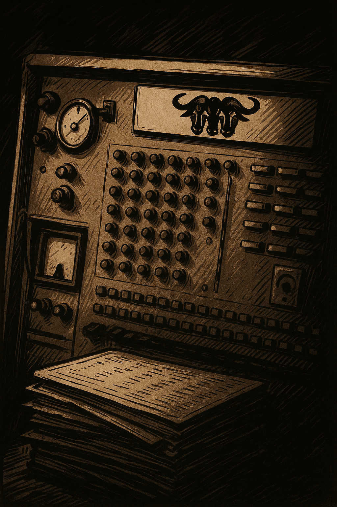

# Caribou?

5th October by Harry

Caribou is the performance name of the mathematician, composer, musician and producer, Dan Snaith. He worked on automorphic forms for his PhD, studying under Kevin Buzzard who is now best known for his campaigning work to integrate mathematics with computer proof verification, or, in his words, “to teach computers to do maths”! Kevin explained why this is necessary in a fabulous TedX talk, that we have linked below. If that is too heavy for a lazy Sunday morning, you can (come) find some of Caribou’s music on Youtube instead:

[https://youtu.be/WNeS4J62v6g] [https://youtu.be/TVmz_llgO50]

    For this week’s puzzle, something entirely different. Did you take a look at this news post about vintage computers?[post-102949] The question you have to answer is: which famous computer scientist is referred to in the post header image, and how?

    And before I go, here is the solution to last week’s puzzle:

    The night was black and wet, and the cave was worse. I went in looking for shelter and found a troll instead. He was ugly the way a fist is ugly—big, raw, and ready to break something. Behind him sat a mountain of coins. Thousands. Gold on one side, silver on the other. Half with the gold sides grinning at me, the others had turned their pale cheeks up. The troll laid it out flat. “Two piles. Same number of silver facing up in each; miss, and you’re dead.” Then he killed the torch. The dark came down heavy, thick enough to choke on. I couldn’t see. Didn’t matter. Guessing was suicide … So I felt around, slow and steady, and pulled half the coins into a pile of their own. Then I flipped them—every last one. When the light came back, the troll looked hard at the piles. He didn’t like what he saw, but he saw it just the same. Each heap had the same silver count. Perfect balance. No luck, just cold, hard math. I walked out of that cave breathing free air, leaving the troll with his gold, his silver, and the sour taste of being outplayed in the dark.
