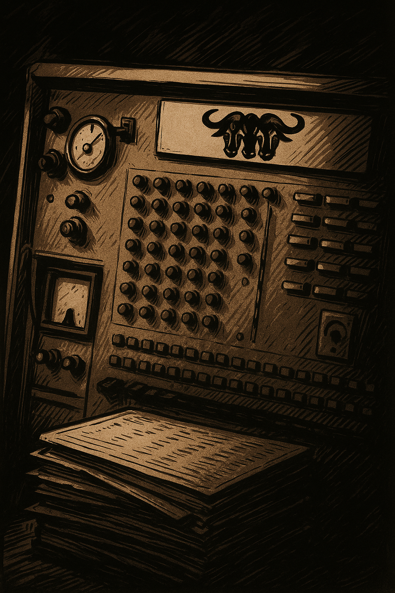

#Knights and knaves

12th October by Harry

The Elves insist that I am a knave who should apologise for last Sunday’s “puzzle”, which they quite rightly tell me was more of a Dad joke than a puzzle. You were asked to identify the famous computer scientist referred to in the post header image and how were they referred to in the image. I loved the suggestion that it referred to Richard Stallman because of the appearance of the 3 gnus on the faceplate and Stallman was a driving force behind the development of gnu software. In fact the reference was to three gnus, so this was a Tri-gnu computer, or a Turing machine as it should properly be called.

Sorry. (The Elves told me I had to say that too.)

That did make me think that we should probably take a look at Knights and Knaves puzzles this week, and while hunting for a suitably obscure version I came across a site which has lots of them, of increasing difficulty. Apparently they were generated by a computer programme and that seems a perfect blend of maths and computing. Ideal for the NCC community.

You can find the puzzles at https://philosophy.hku.hk/think/logic/knights.php.

Enjoy!
