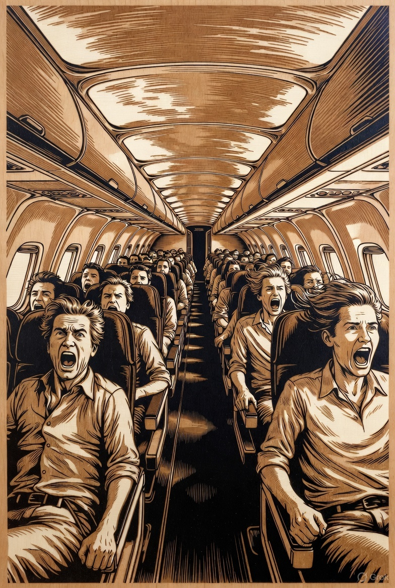
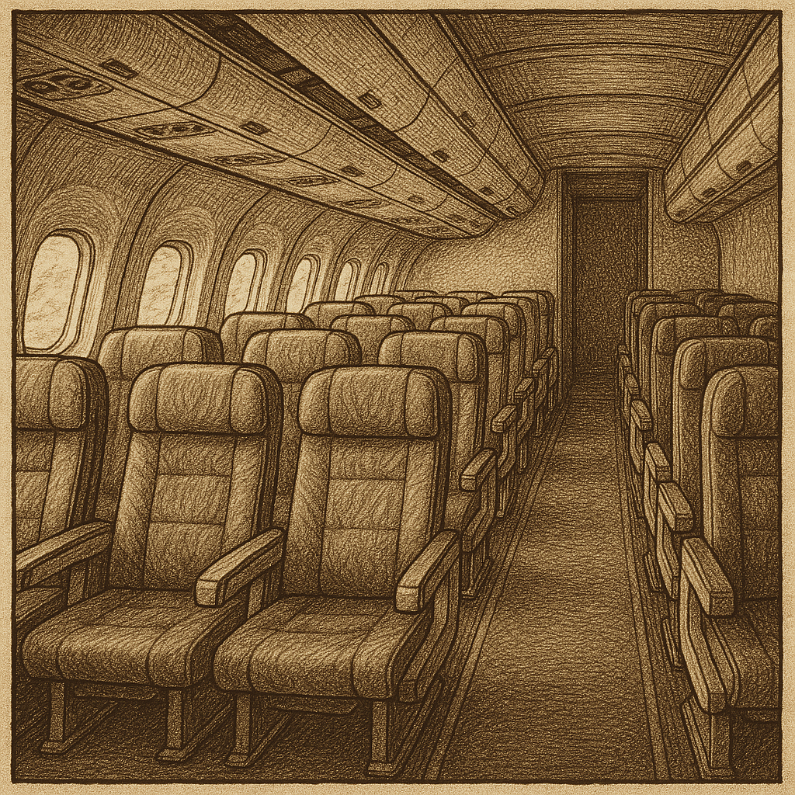

Sunday puzzle time (again!)

16th November by Harry

How did you get on with last week’s puzzle? It is a classic, which might be why Madness immediately knew the answer. He spent the time instead making a new image to illustrate the puzzle, and while I understand the horror of having to argue over someone sitting in the wrong seat on the plane, I have to say the odds that everyone ends up in the wrong seat and equally horrified seem vanishingly remote to me!

Here is the puzzle again in case you didn’t see it:

100 passengers board an aeroplane one after another. The first one cannot find his ticket, so chooses a random (uniformly) seat. All the other passengers do the following when entering the plane (they have their tickets). If the seat written on the ticket is available, they sit on their own seat, if not they choose another empty seat at random. What is the probability the last passenger entering the plane gets the correct seat?

Answer: when the final passenger boards the plane there is one seat left and it can only be their own seat, or the seat that passenger 1 should have sat in. <i>(The reason for that is that if the seat that passenger k should have sat in is still empty when the last passenger chooses, then it was already empty when passenger k boarded. Unless k=1, Passenger k would have sat in their own seat so it would not still be available for passenger 100.)</i> The chance of an individual passenger choosing seat 100 or 1 is zero if their own seat is available and 50/50 if not, so it is equally likely that either of those seats is available to the last passenger, hence passenger 100 has a 50/50 chance of ending up in their own seat.

If you don’t quite believe this somewhat hand-wavey explanation, then try working out what would happen on a smaller plane with say 3 or 4 seats, and if you prefer a more algebraic argument then take a look at the short and elegant article by Yared Nigussie in the American Mathematical Monthly: https://www.tandfonline.com/doi/abs/10.4169/amer.math.monthly.121.06.545. The article is blocked by a paywall, but luckily there is a link to the pdf of the preprint, which I found on Researchgate.

Now for today’s puzzle!

On my birthday this year I noticed that if I reverse the digits of my age I get my father’s age. On my previous birthday he was twice my age. How old was my father when I was born?
