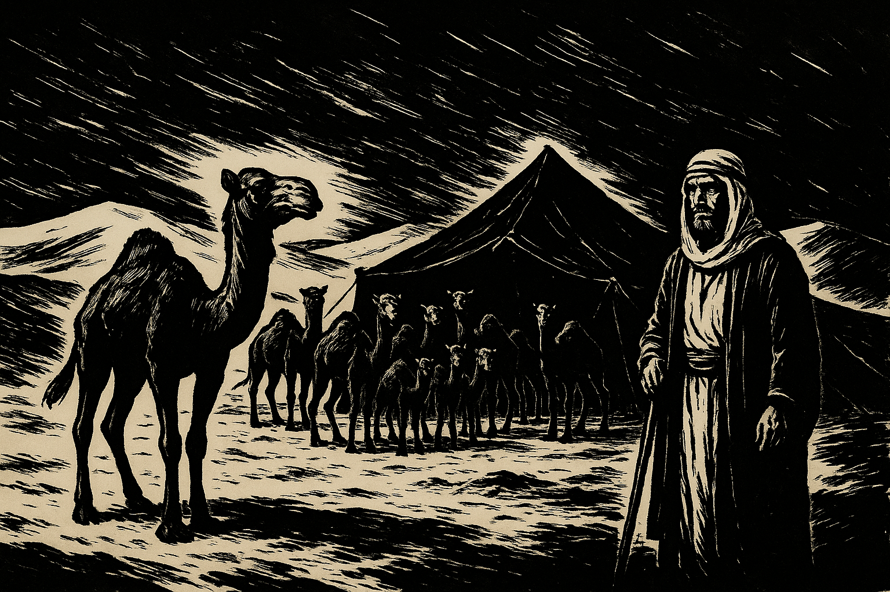
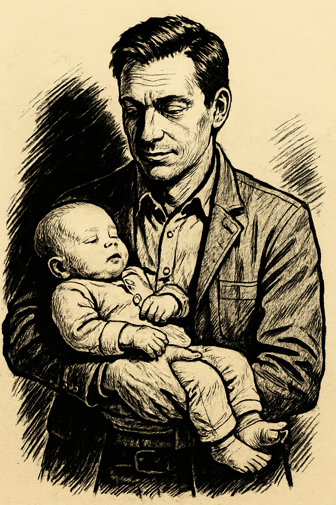

# Almost advent!

23rd November by Harry

How did you get on with the birthday puzzle ?

On my birthday this year I noticed that if I reverse the digits of my age I get my father’s age. On my previous birthday he was twice my age. How old was my father when I was born?

Answer the first thing to notice is that if reversing the digits of my age gives my father’s age then the same thing will have been true 11 years ago, and 11 years before that and so on, so it was true some time when I was aged 0-10. Since my father can’t have been 10 when I was 01, he must have been 20 when I was 02, or 30 when I was 3 or 40 when I was 04 or 50 when I was 05 or 60 when I was 06 etc. So the gap between our ages is a multiple of 9. So he was 18, 27, 36, 45, 54, 63, 72 81 , 90 or 99 when I was born. Since he lived to be twice my age we can discount everything except 18, 27, 36, 45 or 54, and last year he must have been one of the following ages: 36, 54, 72, 90 or 108. Adding 1 gives his age this year as 37, 55, 73, 91 or 109. Reversing the digits gives my age this year: 73, 55, 37, 19 (or 901, which I think we can discount). But I have to be younger than my father so I must be 37 to his 73 or 19 to his 91. Last year we would have been 36 and 72 or 18 and 81, and in only the first of these was I half my father’s age, so the indeed were our ages last year, and I was born when my father was 36.

This week’s puzzle is an oldie and a goodie, which can be traced back to the works of Mulla Muhammad Mahdi Naraqi, an 18th-century Iranian philosopher.

An Arab Sheik, finding himself about to die, called his sons about him and said: “Divide my camels among you in the proportion of one-half of the herd to the eldest son, the second son one-third, and to the youngest son one-ninth.”
Thereupon the oldest son cried: “O, my father, one-half, one-third, and one-ninth do not constitute a whole. To whom, therefore, shall the remainder of the herd be given?”

“To any poor man who may be standing by when the division is made,” replied the Sheik, who thereupon died. When the herd was collected a new difficulty arose. The number of the camels could not be divided either by two or three or nine. While the brothers were disputing, a poor but crafty Bedouin, standing by with his camel, exclaimed, “Behold, I will sell you my beast for ten pieces of silver, so that you may then divide the herd.” Seeing that the addition of one camel would solve the difficulty, the brothers jumped at the offer, and proceeded to divide the herd, but when each had received his allotted portion there yet remained one camel.”I am the poor man standing by.” Said the wise Bedouin, and happily mounting the camel, he rode away, with the brothers’ ten pieces of silver in his turban. Now, how many camels were in the Sheik’s herd?
