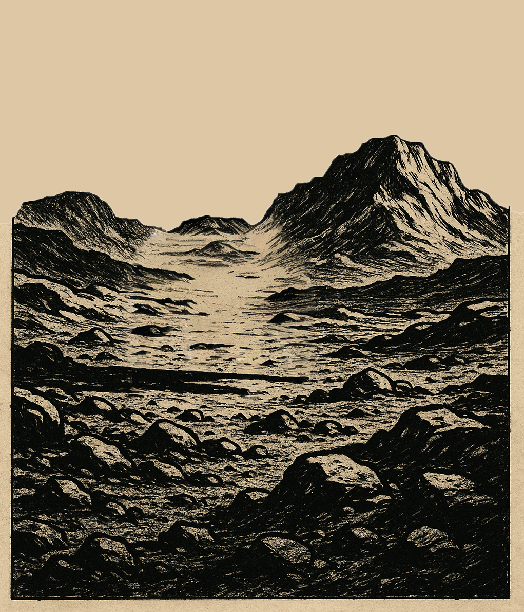
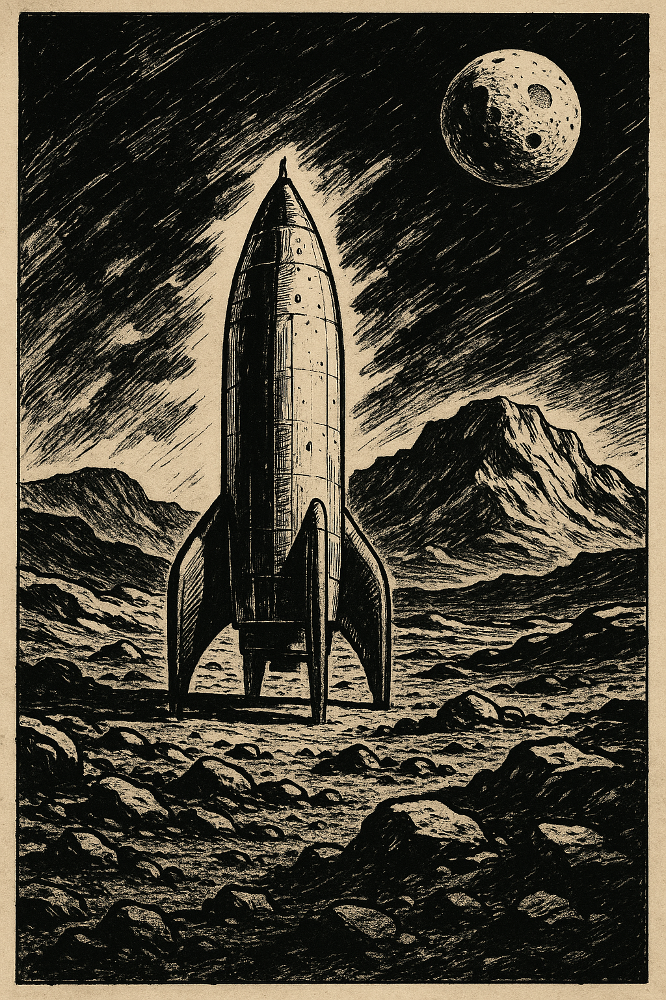

Better late than never!

30th November by Harry

Sorry this is late. We had a family event this weekend. (Even BOSS agents have families and we are a very family friendly top secret organisation!)

Last Sunday we left you thinking about the ancient CamelProblem (see what I did there, programming style fans?) so this week we thought we would bring you into the 21st century with something a little more modern, but before we do that here is the solution.

An Arab Sheik, finding himself about to die, called his sons about him and said: “Divide my camels among you in the proportion of one-half of the herd to the eldest son, the second son one-third, and to the youngest son one-ninth.”
Thereupon the oldest son cried: “O, my father, one-half, one-third, and one-ninth do not constitute a whole. To whom, therefore, shall the remainder of the herd be given?””To any poor man who may be standing by when the division is made,” replied the Sheik, who thereupon died. When the herd was collected a new difficulty arose. The number of the camels could not be divided either by two or three or nine. While the brothers were disputing, a poor but crafty Bedouin, standing by with his camel, exclaimed, “Behold, I will sell you my beast for ten pieces of silver, so that you may then divide the herd.” Seeing that the addition of one camel would solve the difficulty, the brothers jumped at the offer, and proceeded to divide the herd, but when each had received his allotted portion there yet remained one camel.”I am the poor man standing by.” Said the wise Bedouin, and happily mounting the camel, he rode away, with the brothers’ ten pieces of silver in his turban. Now, how many camels were in the Sheik’s herd?

Answer the first thing to notice is that if the original number of camels is not divisible by 2 or 9 then it is not divisible by 18, so the number must have been 18k+r, where r is not 0. But the number after addition of a single camel IS divisible by both, so the remainder term r in the expression above must have been 17 and with the addition of the additional camel the brothers had 18(k+1) camels to distribute. The eldest son received 9(k+1) camels, the second eldest received 6(k+1) camels and the youngest received 2(k+1) camels, leaving k+1 camels for the wise herder. Since there is only one camel remaining, k+1 = 1 and there were 17 camels in the Sheik’s herd.

For this weeks’ puzzle we will take a rocket (told you it was a 21st century puzzle) to Mars, where we find ourselves surrounded by a circle of strange creatures. For reasons that have nothing to do with the puzzle they appear to be able to speak our language, though it quickly becomes apparent that while some of them are honourable truth telling Martians, the remaining among them speak nothing but lies. You ask each of them if the Martian to their left is a liar or a truth teller. If I tell you that, as a member of the BOSS astronaut corps you are fully trained in logic you can use their answers to deduce the proportion of liars in the circle, what proportion must that be?
