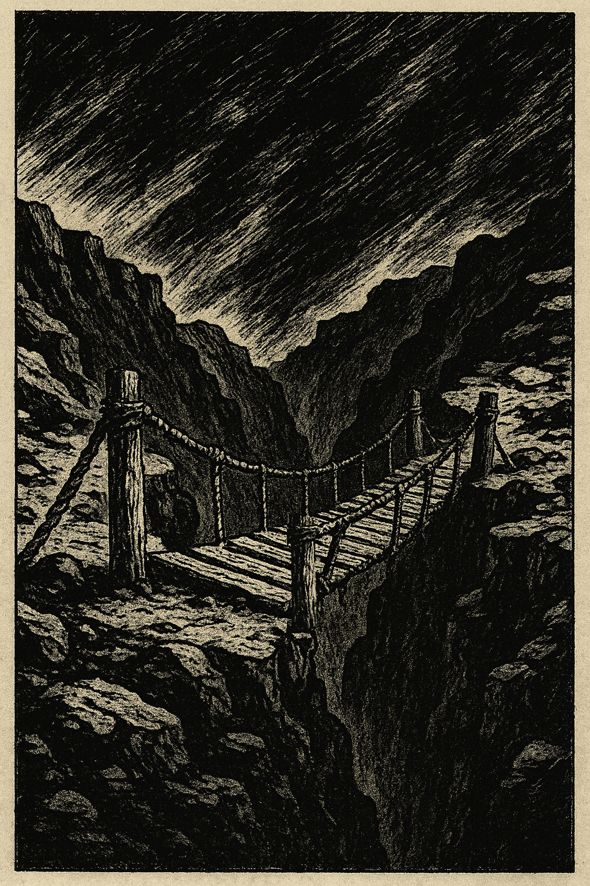

#Bridge of sighs?

7th December by Harry

Following the ancient camel problem last week’s puzzle brought us into the 21st century with a rocket challenge: we found ourselves on Mars surrounded by a circle of strange creatures. For reasons that had nothing to do with the puzzle they appeared to be able to speak our language, though it quickly became apparent that while some of them were honourable truth telling Martians, the remaining among them spoke nothing but lies. You asked each of them if the Martian to their left was a liar or a truth teller. I told you that, as a member of the BOSS astronaut corps you were fully trained in logic and that as a result you could use their answers to deduce the proportion of liars in the circle. The question was: what proportion must that be?

Answer Notice that if every Martian switched from truth teller to liar and vice versa then their answers remain the same even though the proportions of liars and truth tellers has switched. So the proportions must be the same, i.e., exactly half of the Martian’s are liars and half are truth tellers!

For this week’s puzzle we return to terrestrial travel with the classic bridge and torch puzzle, with this version stolen from Wikipedia. Other versions can be found across the web: Four people come to a river in the night. There is a narrow bridge, and it can only hold two people at a time. They have one torch and, because it’s night, the torch has to be used when crossing the bridge. Person A can cross the bridge in 1 minute, B in 2 minutes, C in 5 minutes, and D in 8 minutes. When two people cross the bridge together, they must move at the slower person’s pace. The question is, can they all get across the bridge if the torch lasts only 15 minutes?
