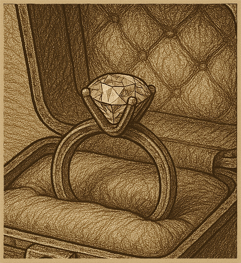

# On the first day of Christmas …

14th December by Harry

Last Sunday found us standing on the edge of a yawning chasm trying to solve a classic bridge and torch puzzle: four people come to a river in the night. There is a narrow bridge, and it can only hold two people at a time. They have one torch and, because it’s night, the torch has to be used when crossing the bridge. Person A can cross the bridge in 1 minute, B in 2 minutes, C in 5 minutes, and D in 8 minutes. When two people cross the bridge together, they must move at the slower person’s pace. The question is, can they all get across the bridge if the torch lasts only 15 minutes?

Answer The slowest walkers slow everyone down so it makes sense to send them together. First A and B cross the bridge together, taking 2 minutes to cross, then A returns taking another minute. Next C and D cross together taking 8 minutes and B returns taking another 2 minutes. Now A and B cross again taking just 2 minutes for a total of 2+1+8+2+2 = 15 minutes. As a couple of our community pointed out you can model this nicely in terms of graph theory and solve it for more general versions of the puzzle!

All of which reminded me of another classic puzzle which I was told by a Philips cryptologist when he came to give a guest lecture to the maths students at Southampton. I suspect many of you already know it, but it feels suitable for this audience, and now is the right time to ask it: Boris and Anastasia have fallen for one another (via the internet) and Boris wishes to send Anastasia a ring to pledge his undying love. [Kids! Don’t do that!! They might be catfishing!!!] Unfortunately, our young lovers cannot trust the mail in Kleptopia, as anything not secured in a locked box will certainly be stolen. Boris and Anastasia each have plenty of boxes and padlocks, but Boris needs to find a way to safely send the box AND the key so that Anastasia can open it. Your mission …. (you get the idea)

PS (pre script again) I know it was a partridge in a pear tree on the first day of Christmas, and it was (were?) FIVE gold rings, not one diamond ring, on the fifth day, AND it is not even the first day yet, but I needed to find some way to get us all in the right mood because I will be posting my Christmas Miscellany soon and I want you all to rush over to read it when I do.
