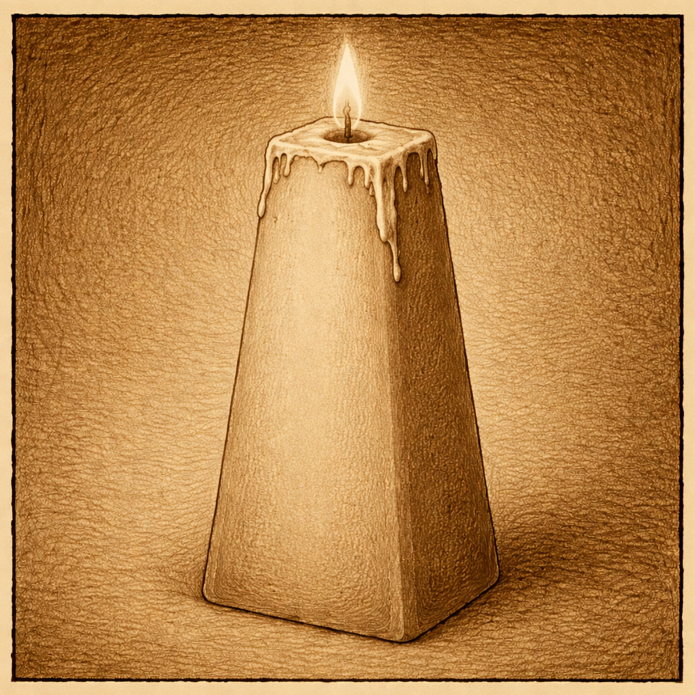

# Last Sunday (puzzle) of Advent …

21st December by Harry

Last week’s puzzle asked us to help the young lovers Boris and Anastasia from the land of Kelptopia: Boris and Anastasia have fallen for one another (via the internet) and Boris wishes to send Anastasia a ring to pledge his undying love. [Kids! Don’t do that!! They might be catfishing!!!] Unfortunately, our young lovers cannot trust the mail in Kleptopia, as anything not secured in a locked box will certainly be stolen. Boris and Anastasia each have plenty of boxes and padlocks, but Boris needs to find a way to safely send the box AND the key so that Anastasia can open it. Your mission …. (you get the idea)

**Answer** This is the “real world” puzzle of how to exchange a (cipher) key over an insecure channel. It was famously solved by Diffie and Hellman who designed the D-H key exchange protocol used almost everywhere to secure communications. Typically it is used to set up an agreed key between two parties who want to communicate using an efficient, symmetric cipher like the AES Rijndael algorithm. First they have to tell one another which key to use, but in circumstances where anything they say can be overheard by “the enemy”. The cipher key is replaced by the diamond ring, hackers by thieves and so on. You get the idea. The solution for Boris and Anastasia is as follows: Boris places the ring in a secure box and fits it with a padlock. Locking it he keeps the key and posts the box to Anastasia. The thieves of Kleptopia are unable to open the box and so it arrives safely with Anastasia, who also cannot open the box as she does not have the key. However she does have her own padlock, which she adds to the box, locking it even more securely. She sends the box back to Boris, frustrating the would be thieves and it arrives safely with Boris. Boris patiently unlocks his own padlock and removes it, then returns the box, still secured with Anastasia’s padlock to her, whereupon she is able to remove the padlock and open the box to receive the ring.

If you understand that process then you know just about everything you need to know about Diffie-Helmann key exchange, but I leave you to look that up for yourself!

For the last Sunday of Advent we have this classic from competitor Upsidedown. I stole this (with their permission) from their forum post on Thursday because I think it deserves more prominence:

    Here is a “real life” maths “problem” that I had honestly did have to solve a few years ago:

    This year we have an advent candle in the shape of a square frustum, rather than the usual cylindrical design. However, the numbering is linear by height, which does not account for the increase in volume as you go down the candle. It seems to me that it would make more sense to number by volume rather than by slant length, so that the candle needs to reduce by the same volume each day of advent. Given that the side length of the base of the frustum is a, and the side length of the top is b, find an expression for the position along the slanted side where the nth day of advent should be marked.

    The expression should be in terms of a, b, and n, and should be the bottom of the region of volume associated with the day. Days are numbered starting at 1 and (obviously) go up to 24.

